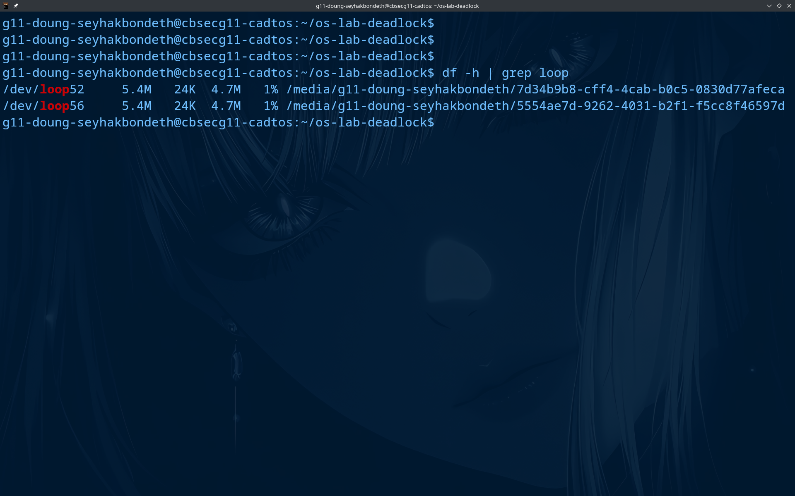
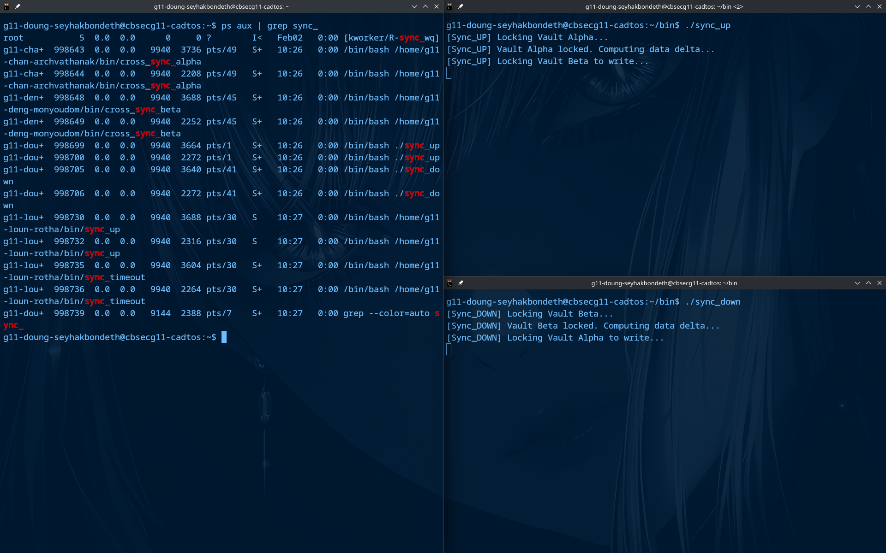

# OS_labdeadlock_IDTB110120
Level1

Both virtual drives are successfully mounted as loopback devices. /dev/loop52 represents vault_alpha and /dev/loop56 represents vault_beta. Each has 5.4MB total capacity with 4.7MB available because the ext4 filesystem was formatted correctly and the drives are live and accessible by the OS.ext4 uses some space for its own internal structures like the journal, inode tables, and superblocks which is completely normal.
Level2

Both scripts frozed and never reached "Sync complete." sync_up successfully acquired the Alpha lock (fd 200) first, then requested the Beta lock (fd 201). At the same time, sync_down successfully acquired the Beta lock (fd 201) first, then requested the Alpha lock (fd 200). Neither script would release its held lock until it acquired the second one — creating a classic Circular Wait. The ps aux output confirms both processes (PIDs 998699/998700 for sync_up and 998705/998706 for sync_down) were alive but permanently suspended, consuming resources without making any progress.
